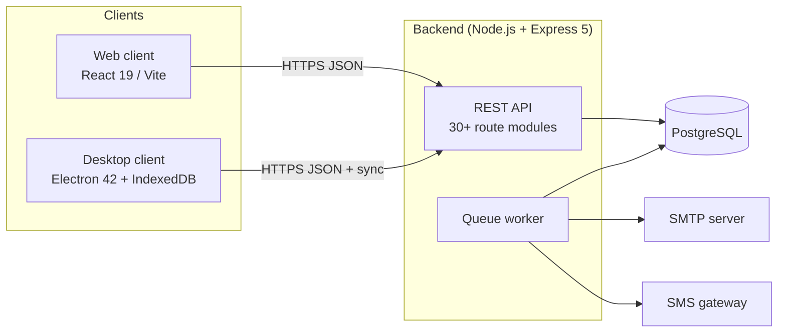

# 02 — Software Requirements Specification (SRS)

**Project:** Multi-Platform Inventory Management System with RESTful API Backend
**Standard:** IEEE 830 (adapted)
**Version:** 1.0 — August 2026

---

## 1. Introduction

### 1.1 Purpose
This document specifies the functional and non-functional requirements of the
Multi-Platform Inventory Management System (MPIMS): a RESTful-API-driven
inventory platform with a browser client and an offline-capable desktop
client used by retail businesses operating multiple branches.

### 1.2 Scope
The system provides:
- Multi-branch inventory tracking with per-branch stock, reorder levels and
  full stock-movement history.
- Point-of-Sale (POS) checkout with barcode support, including **offline**
  operation on the desktop client.
- Purchasing (purchase orders → receiving → supplier payments).
- Inter-branch stock transfers.
- Customer management and customer payments.
- Role-based administration of users, branches, roles and permissions.
- Notifications via in-app, e-mail and SMS channels with audience targeting.
- Business reporting with CSV/Excel/PDF exports.
- A background message queue for reliable asynchronous message delivery.

Out of scope: accounting/general ledger, payroll, e-commerce storefronts.

### 1.3 Definitions & Acronyms

| Term | Meaning |
|------|---------|
| MPIMS | Multi-Platform Inventory Management System |
| PO | Purchase Order |
| QoH | Quantity On Hand |
| PBI | `product_branch_inventory` — per-branch stock row |
| RBAC | Role-Based Access Control |

### 1.4 References
IEEE 830-1998; project WBS (`01-work-breakdown.md`); source code in this repository.

---

## 2. Overall Description

### 2.1 Product Perspective
A three-tier system: a Node.js/Express RESTful API over PostgreSQL, consumed by
a React web client (browser) and an Electron desktop client that can operate
offline against a local IndexedDB cache and re-synchronise later.

### 2.2 Product Functions (summary)
Authentication & branch selection; product catalogue management; multi-branch
inventory; stock movements; transfers; purchasing; POS sales; customers;
expenses; notifications; reporting; user/role administration; audit logging;
offline synchronisation; background job processing.

### 2.3 User Classes & Characteristics

| User class | Typical duties | Key screens |
|------------|----------------|-------------|
| Business Owner | Oversight across all branches, settings | Dashboard, Reports, Branches, Users |
| Administrator | System configuration, accounts, queue monitoring | Users, Roles, Message Queue, Audit Logs |
| Branch Manager | Branch operations oversight | Inventory, Purchases, Transfers, Low Stock |
| Storekeeper | Receiving goods, stock counts/movements | Purchases, Stock Movements, Products |
| Cashier | Selling to walk-in customers | POS, Sales |

### 2.4 Operating Environment
- **Server:** Node.js ≥ 20, PostgreSQL ≥ 14, Windows/Linux/macOS.
- **Clients:** modern browsers (Chrome/Edge/Firefox); Windows desktop via
  Electron installer; optional HID barcode scanners (node-hid).
- **Network:** HTTPS required for clients; system remains usable offline on
  the desktop client for cached branch data.

### 2.5 Design & Implementation Constraints
- REST/JSON over HTTP(S) only; stateless access tokens (JWT) with refresh
  rotation; tokens are branch-scoped after selection.
- All monetary values recorded per sale/payment rows; totals recalculated
  server-side.
- Deletion is soft (`is_active = false`) — historical references must survive.
- E-mail delivery must degrade gracefully (queue + log fallback), never block
  the triggering request.

### 2.6 Assumptions & Dependencies
- Each business has at least one active branch; users may belong to many branches.
- Gmail SMTP credentials (app password) available for outbound mail.
- Desktop devices have local storage sufficient for one branch's catalog cache.

---

## 3. Specific Requirements (Functional)

Requirement IDs use `FR-<module>-<n>`. "Shall" denotes mandatory behaviour.

### 3.1 Authentication & Session Management (AUTH)
- **FR-AUTH-1** The system shall authenticate users with username/e-mail +
  password (bcrypt-hashed) and issue an access token and refresh token.
- **FR-AUTH-2** After login, the user shall select an active working branch;
  the API shall re-issue tokens embedding the selected branch context.
- **FR-AUTH-3** If a user has exactly one assigned branch, it shall be
  selected automatically.
- **FR-AUTH-4** Refresh tokens shall rotate on use and be revocable per session.
- **FR-AUTH-5** The system shall support self-service password reset using a
  single-use token delivered by e-mail, valid for one hour.
- **FR-AUTH-6** Login history (IP, device) shall be recorded.

### 3.2 Authorisation (RBAC) (PERM)
- **FR-PERM-1** Permissions shall be grouped into named roles and assignable
  per user.
- **FR-PERM-2** Protected endpoints shall enforce permission checks
  (e.g., `MANAGE_NOTIFICATIONS`) in addition to authentication.
- **FR-PERM-3** Administrators shall manage roles and their permission sets
  through the UI.

### 3.3 Catalogue Management (CAT)
- **FR-CAT-1** CRUD for products (SKU, barcode, name, base UoM, supplier,
  category), categories, suppliers and units of measure.
- **FR-CAT-2** Product images shall be uploadable; one primary image shown in lists.
- **FR-CAT-3** Deactivated (soft-deleted) records shall be hidden from default
  listings but restorable; listings may opt in to include inactive items.
- **FR-CAT-4** Price changes shall be tracked in a price history table.

### 3.4 Multi-Branch Inventory (INV)
- **FR-INV-1** Stock levels shall be maintained **per product per branch**
  (QoH, reorder level, reorder quantity).
- **FR-INV-2** Listing endpoints scoped to the signed-in branch by default;
  explicit branch filters accepted in both camelCase and snake_case keys.
- **FR-INV-3** Stock movements (IN/OUT/ADJUSTMENT/TRANSFER) shall append-only
  record quantity, reference and actor, and update PBI atomically.
- **FR-INV-4** Stock-out requests shall validate availability and reject
  quantities exceeding available stock.
- **FR-INV-5** Transfers shall move stock between two branches, decrementing
  source and incrementing destination within one transaction.
- **FR-INV-6** The system shall flag low-stock items (QoH ≤ reorder level).

### 3.5 Purchasing (PO)
- **FR-PO-1** Create purchase orders per branch with line items
  (product, quantity, unit cost).
- **FR-PO-2** Items shall be addable/editable/removable only while the PO is
  in DRAFT status; attempts otherwise shall fail with HTTP 409.
- **FR-PO-3** PO totals shall be recalculated automatically after every item
  change (no stale totals).
- **FR-PO-4** Receiving a PO shall increase destination-branch stock and log
  inventory transactions.
- **FR-PO-5** Supplier payments shall be recordable against POs/suppliers.

### 3.6 Sales / POS (POS)
- **FR-POS-1** The POS shall search products by name/SKU/barcode within the
  current branch and show live availability.
- **FR-POS-2** Checkout shall create a sale with items, decrement branch
  stock transactionally and produce a receipt record.
- **FR-POS-3** Barcode input shall be supported (manual entry, scanner via
  keyboard wedge or HID on desktop).
- **FR-POS-4** Offline (desktop): sales shall be creatable against the local
  cache and queued for synchronisation; conflicts reported in Sync Logs.
- **FR-POS-5** Customer payments and outstanding balances shall be trackable
  per customer.

### 3.7 Notifications (NOTIF)
- **FR-NOTIF-1** Authenticated staff shall compose notifications with title,
  message, type and channels (in-app, e-mail, SMS).
- **FR-NOTIF-2** Recipients shall be selectable as specific users, ALL active
  users, or all active users of a chosen branch (`target`: USERS/ALL/BRANCH),
  resolved at send time.
- **FR-NOTIF-3** Delivery shall occur through the persistent message queue
  with retry/backoff; each recipient gets independent read-state.
- **FR-NOTIF-4** Users shall view their notifications, mark them read and
  delete them.

### 3.8 Background Message Queue (QUEUE)
- **FR-QUEUE-1** Every e-mail/SMS send shall be enqueued persistently before
  delivery is attempted.
- **FR-QUEUE-2** Failed jobs shall retry with exponential backoff
  (attempt² × 30 s, capped at 1 h) up to a configurable maximum; exhausted jobs
  become FAILED with the last error stored.
- **FR-QUEUE-3** A retried (requeued) job shall return to PENDING so the worker
  can claim it again.
- **FR-QUEUE-4** Administrators shall list jobs filtered by status/type and
  resend PROCESSING/FAILED jobs manually.

### 3.9 Reporting (RPT)
- **FR-RPT-1** Daily, monthly and annual sales reports; profit report;
  inventory valuation report; low-stock report — optionally branch-scoped.
- **FR-RPT-2** Tabular datasets (products, inventory, sales…) shall export to
  CSV, Excel and PDF.

### 3.10 Administration (ADMIN)
- **FR-ADMIN-1** CRUD for users, branches, business profile and system settings.
- **FR-ADMIN-2** Users may be assigned to multiple branches; branch switching
  updates the session context immediately.
- **FR-ADMIN-3** Audit logs shall capture privileged actions with actor,
  action and timestamp; activity logs capture entity changes.

### 3.11 Synchronisation (SYNC)
- **FR-SYNC-1** The desktop client shall pull branch-scoped snapshots
  (products, inventory, customers, etc.) into IndexedDB once a branch is selected.
- **FR-SYNC-2** Mutations performed offline shall be pushed when connectivity
  returns; every sync run shall be logged with outcome.

---

## 4. Non-Functional Requirements

| ID | Category | Requirement |
|----|----------|-------------|
| NFR-1 | Security | Passwords bcrypt-hashed; JWT access+refresh with rotation; helmet, CORS allow-list, rate limiting, HPP and XSS-clean middleware enabled |
| NFR-2 | Security | All privileged actions audit-logged; login history retained |
| NFR-3 | Reliability | Message sends never lost: persistent queue with retries; SMTP failure falls back to structured console logging without blocking the request |
| NFR-4 | Performance | List endpoints paginated (default 25–50 rows); search uses indexed ILIKE queries; POS search responds < 300 ms on LAN |
| NFR-5 | Usability | Consistent glass-card UI; destructive actions confirmed; validation errors displayed inline/toast |
| NFR-6 | Portability | Web client runs in evergreen browsers; desktop ships as Windows installer |
| NFR-7 | Maintainability | Layered backend (routes → controllers → services → repositories); TypeScript front ends; oxlint clean |
| NFR-8 | Data integrity | Money/quantity mutations execute inside DB transactions; PO totals recomputed server-side; soft deletes preserve history |

---

## 5. External Interfaces

### 5.1 REST API
Base path `/api/v1`. JSON bodies; JWT bearer auth; standard envelope
`{ success, data }`. Representative resources:

| Area | Endpoints (illustrative) |
|------|---------------------------|
| Auth | `POST /auth/login`, `POST /auth/select-branch`, `POST /auth/refresh`, `POST /auth/forgot-password`, `POST /auth/reset-password` |
| Catalogue | `/products/search` (POST), `/categories`, `/suppliers`, `/uoms`, `/product-images` |
| Inventory | `/inventories/search` (POST), `/inventory-transactions`, `/inventory-transfers` |
| Purchases | `/purchases` (+ item routes; guarded by DRAFT status) |
| Sales | `/sales`, carts |
| People | `/users`, `/user-branches`, `/roles`, `/permissions`, `/customers`, `/customer-payments` |
| Messaging | `/notifications`, `POST /notifications` (target USERS/ALL/BRANCH), `/admin/queue`, `POST /admin/queue/:id/resend` |
| Reports | `/reports/daily-sales`, `/reports/monthly-sales`, `/reports/profit`, `/reports/inventory-report`, `/reports/low-stock` |
| Sync | `GET /sync/:entity/pull?branchId=…&since=…` |
| Ops | `/audit`, `/sessions`, `/system`, expenses, price history, SMS balance |

Interactive documentation: Swagger UI served by the backend
(swagger-jsdoc + swagger-ui-express).

### 5.2 E-mail Interface
SMTP via Gmail (implicit TLS, port 465). Templates: password reset, account
updated, role changed, notification fan-outs — wrapped in branded layout
generated from business settings.

### 5.3 Hardware Interface (desktop)
HID barcode scanners via node-hid; keyboard-wedge scanners supported everywhere.

---

## 6. Acceptance Criteria (excerpt)

| # | Scenario | Expected result |
|---|----------|-----------------|
| AC-1 | Selecting branch B hides products stocked only in branch A | Products page shows exactly B's catalogue (verified: Main Shop 8, Second Store 2, Tema 4) |
| AC-2 | Editing items of a received PO | HTTP 409 rejection |
| AC-3 | Sending notification with target=BRANCH | One recipient row per active user of that branch only (verified 7 for ALL, 1 for single-user branch) |
| AC-4 | Stock-out beyond availability | Rejected with clear message showing available stock |
| AC-5 | SMTP outage during password reset | Request still succeeds; job queued and retried; admin can Resend |
