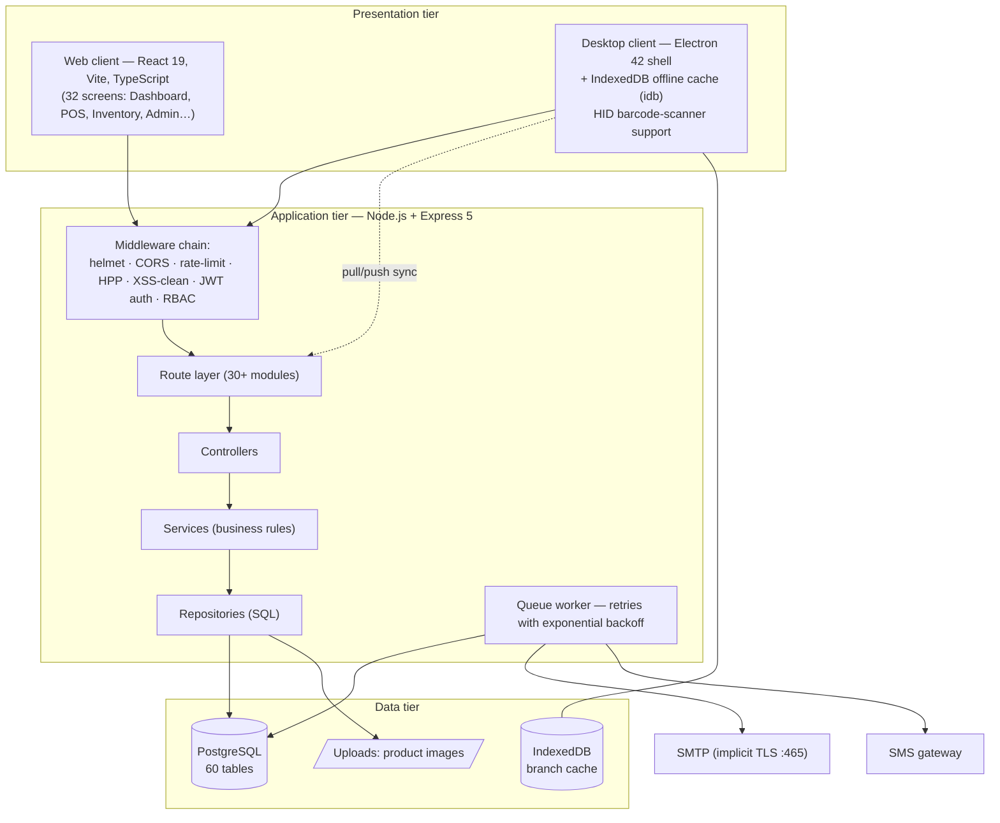
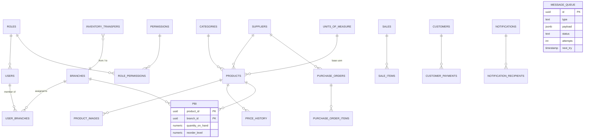

# 03 — Project Chapter (Condensed Report)

**Project:** Multi-Platform Inventory Management System with RESTful API Backend
**Period covered:** February – August 2026

---

## Chapter 1 — Introduction

### 1.1 Background
Small and medium retail businesses that operate from more than one location
commonly track stock with paper books or disconnected spreadsheets. This leads
to stock-outs discovered only at the counter, unnoticed shrinkage, pricing
inconsistencies between branches, and management decisions made on stale
information. Cloud inventory tools exist, but many assume constant internet
connectivity — an unrealistic assumption for shops in areas with unreliable
power and network coverage.

### 1.2 Problem Statement
There is a need for an inventory system that:
1. presents **one shared, accurate view of stock per branch** in real time;
2. keeps **selling even when the internet is down** (offline POS);
3. enforces **accountability** through roles, permissions and audit trails;
4. reaches staff through multiple channels (**in-app, e-mail, SMS**) reliably;
5. remains affordable and operable on ordinary Windows computers.

### 1.3 Objectives
- Design and implement a RESTful API backend that centralises all business data.
- Provide a web client for administrative work and a desktop client for the shop floor.
- Guarantee per-branch stock correctness with transactional updates.
- Support asynchronous notifications through a persistent retry-able queue.
- Document the system to handover quality.

### 1.4 Scope & Limitations
In scope: multi-branch inventory, POS (online + offline), purchasing,
transfers, customers, expenses, notifications, reporting, RBAC administration.
Limitations: no double-entry accounting; SMS delivery depends on the gateway
provider's balance; offline mode is limited to cached branch data on desktop.

---

## Chapter 2 — Background & Related Work

Commercial systems (e.g., generic POS suites) typically bind merchants to
subscription plans and online-only operation. Academic literature on retail
information systems stresses three recurring requirements: data consistency
across sites, resilience to connectivity loss, and traceability of stock
movements. This project applies those principles with an offline-first desktop
design, a single authoritative database, and append-only movement ledgers.
Where commercial tools charge per terminal, this system uses open technologies
(Node.js, PostgreSQL, React, Electron), keeping running costs to hosting and
an SMTP account.

---

## Chapter 3 — System Analysis & Design

### 3.1 Methodology
An incremental, feature-driven process was used: each module (auth → catalogue
→ inventory → purchases → sales → notifications) moved through
requirements → design → implementation → live-database verification before the
next began, allowing early feedback from the business owner.

### 3.2 Architecture

### 3.3 Database Design (core entities)

Key decisions:
- **Per-branch stock rows (`product_branch_inventory`)** instead of a single
  quantity column make branch scoping a simple join and prevent cross-branch
  over-selling.
- **Soft deletes** (`is_active`) keep historical references valid; listings
  hide inactive records unless explicitly requested.
- **Append-only ledgers** for movements and price history provide full auditability.
- **`message_queue`** decouples message sending from request handling.

### 3.4 Security Design
Layered controls: bcrypt password hashing; short-lived access tokens plus
rotating refresh tokens; tokens re-issued with branch context after selection;
permission middleware per route group; hardened HTTP surface (helmet, rate
limiting, parameter-pollution and XSS protection); privileged actions written
to `audit_logs`; login history with IP/device details; one-hour single-use
password-reset tokens delivered by e-mail.

### 3.5 Offline Strategy (desktop)
On branch selection the client pulls a branch-scoped snapshot (products,
inventory, customers…) into IndexedDB. The POS reads from cache when offline
and queues mutations; when connectivity returns it pushes them and logs the
result in Sync Logs. The cache is invalidated and rebuilt whenever the selected
branch changes.

---

## Chapter 4 — Implementation & Testing

### 4.1 Technology Choices

| Layer | Technology | Rationale |
|-------|-----------|-----------|
| API | Node.js + Express 5 | Ubiquitous, JSON-native, large ecosystem |
| Database | PostgreSQL | Transactional integrity, rich types (jsonb payloads) |
| Auth | jsonwebtoken + bcrypt | Proven stateless session pattern |
| Web UI | React 19 + Vite + TypeScript | Fast DX, type safety |
| Desktop | Electron 42 + idb + node-hid | Offline storage + scanner hardware access |
| Mail/SMS | Nodemailer (SMTP implicit TLS) + gateway | Reliable branded e-mail; SMS reach |
| Docs/QA | swagger-jsdoc/UI, Jest, Supertest, oxlint, tsc | Contract clarity and regression safety |

### 4.2 Representative Implementations
- **Branch-aware catalogue search:** `/products/search` inner-joins
  `product_branch_inventory` when a branch filter is present; the controller
  normalises both camelCase and snake_case keys so every caller is served.
- **PO lifecycle guard:** item add/update/remove routes resolve the parent PO
  and reject changes once status leaves DRAFT (HTTP 409); totals are
  recalculated inside the same transaction as item mutations.
- **Notification targeting:** `target ∈ {USERS, ALL, BRANCH}` resolves to
  concrete recipient rows at send time (active users only), giving each
  recipient independent read-state; fan-out jobs flow through the queue.
- **Queue reliability:** failures increment attempts and schedule retries at
  `attempt² × 30 s` (cap 1 h); requeue resets status to PENDING; administrators
  can resend stuck PROCESSING/FAILED jobs from the Message Queue screen.
- **Resilient e-mail:** transport uses implicit TLS on port 465 (STARTTLS on
  587 proved unreliable on target networks); on failure the service logs the
  full message and reports `success:false` so callers can enqueue a retry.

### 4.3 Testing Approach
1. **Endpoint verification against the live database** — scripted controller
   invocations asserting exact row counts (e.g., branch-filtered catalogue:
   Main Shop 8, Second Store 2, Tema 4 products).
2. **Rule-based tests** — DRAFT-only PO editing, availability checks on stock-out,
   notification audience resolution (ALL = 7 recipients vs BRANCH = 1),
   queue resend guards (409 on DONE, 404 on unknown id).
3. **Static analysis** — oxlint clean on both clients; `tsc -b` build gate.
4. **Manual UAT** — role-based walkthroughs with the business owner.

### 4.4 Defects Found & Fixed (highlights)

| Defect | Root cause | Fix |
|--------|-----------|-----|
| Products identical across branches | snake/camelCase key mismatch silently dropped the branch filter | Server-side key normalisation + clients send `branchId` |
| Stock-out modal showed wrong availability | `/inventories/search` ignored snake_case filters | Controller normalisation + camelCase clients |
| PO total stayed 0.00 after item edits | Total never recomputed | Recalculate in-service + backfill script |
| E-mails never delivered ("Unexpected socket close") | STARTTLS on port 587 blocked mid-handshake | Implicit TLS 465 + configurable secure flag |
| Queue jobs stuck in PROCESSING forever | Retry path set `next_try` but not status back to PENDING | Requeue sets `status='PENDING'` |

---

## Chapter 5 — Conclusion & Future Work

### 5.1 Conclusion
The project delivers a complete, working multi-platform inventory system:
a hardened RESTful API, a full-featured web client, and an offline-capable
desktop POS, together with reliable asynchronous messaging and comprehensive
documentation. All acceptance scenarios from the SRS were demonstrated against
the live system.

### 5.2 Future Work
- Demand forecasting for automatic reorder suggestions.
- Native mobile client for stock counts.
- Multi-business tenancy for hosted deployments.
- Integration with mobile-money payment gateways at POS.
- Automated end-to-end browser tests in CI.
