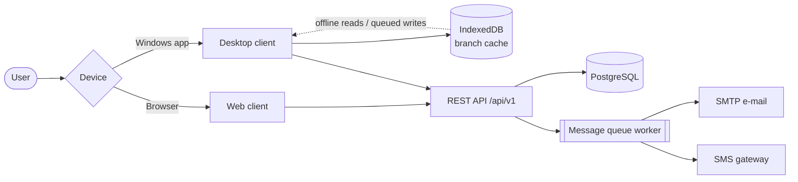
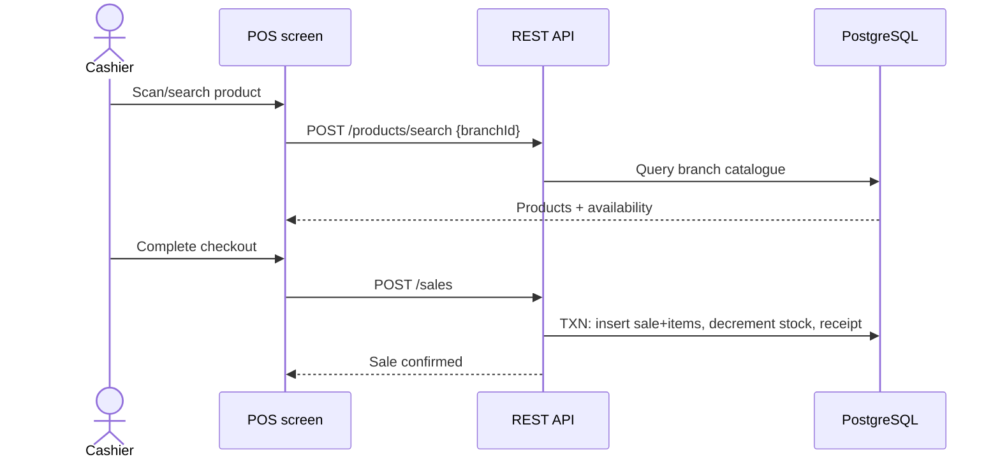
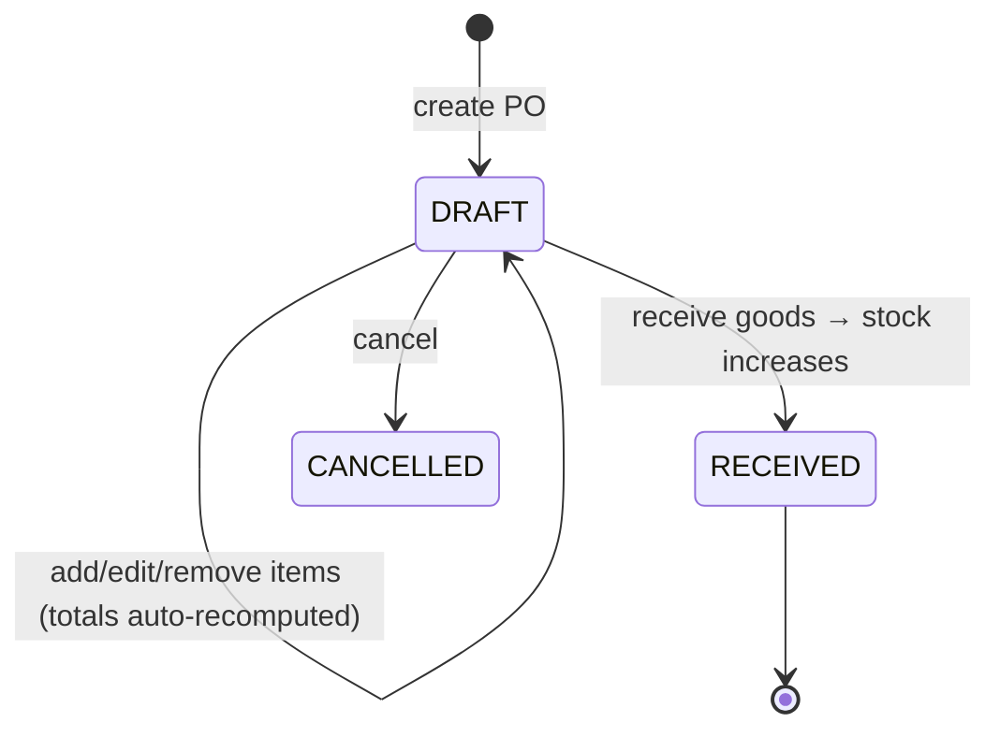
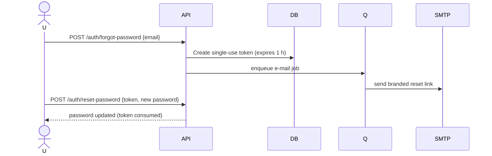
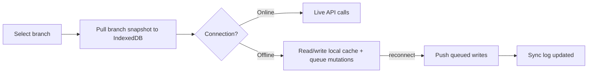

# 04 — Prototype Description

**Project:** Multi-Platform Inventory Management System with RESTful API Backend
The prototype is a **fully working system**, not a mock-up: every screen and
flow described here exists in the codebase and runs against a live PostgreSQL
database.

---

## 1. Prototype Overview

| Aspect | Web client | Desktop client |
|--------|-----------|----------------|
| Framework | React 19 + Vite 8 + TypeScript | Same UI stack inside Electron 42 |
| Data access | REST (axios) over HTTPS | REST + IndexedDB offline cache (`idb`) |
| Offline support | None (requires connection) | Full POS operation offline, auto re-sync |
| Hardware | Keyboard-wedge barcode scanners | HID scanners via `node-hid` + wedge |
| Distribution | Served by Vite build / static host | Windows installer via `electron-builder` |

Shared backend: Node.js + Express 5 REST API with PostgreSQL.

---

## 2. Screen Inventory (web & desktop share the same set)

**Operational:** Dashboard · POS · Sales · Products · Categories · Inventory ·
Inventory History · Stock Movements · Transfers · Purchases · Suppliers ·
Customers · Price History · Low Stock Alerts · Expenses

**Communication:** Notifications · Create Notification · Message Queue · SMS Balance

**Administration:** Users · Roles · Branches · Business Settings · System Settings ·
Settings · My Profile · Audit Logs · Sync Logs · Sync

**System:** Login · Select Branch · Not Found (404)

---

## 3. Key Screen Walkthroughs

### 3.1 Login → Select Branch
1. User signs in with username/e-mail + password.
2. The **Select a Branch** screen lists assigned branches as cards
   (name, address, city; inactive ones disabled).
3. Choosing a branch re-issues the auth token with branch context and opens
   the Dashboard. Single-branch users skip this screen automatically.
4. The current branch is always visible in the top bar; switching returns to
   this screen and reloads branch-scoped data everywhere.

### 3.2 Dashboard
KPI cards and charts summarising sales and stock position for the selected
branch, with quick links into daily operations.

### 3.3 Point of Sale (POS)
- Product search box accepts name/SKU/**barcode** (scanner-ready).
- Results show live availability **for the current branch** ("Available stock: N").
- Cart panel accumulates items with quantity steppers; totals update instantly.
- Checkout finalises the sale, decrements branch stock atomically and issues
  a receipt. On desktop this flow works **with no internet**: products come
  from cache and the sale syncs later.

### 3.4 Products
Paginated catalogue for the branch with search; create/edit forms cover SKU,
barcode, category, supplier, base UoM and initial stock; CSV import maps
columns to fields. Deactivated products are hidden unless "include inactive"
is requested; exports honour the active filters.

### 3.5 Stock Movements
Ledger of IN/OUT/ADJUSTMENT/TRANSFER entries with actor and reference.
"Record movement" modal searches the branch's products only, validates the
quantity against available stock and blocks negatives — preventing overselling
at entry time.

### 3.6 Purchases
Purchase orders list per branch. A PO in **DRAFT** allows free item editing;
the moment it leaves DRAFT, item add/update/remove are rejected server-side
(HTTP 409). Totals recalculate automatically on every change. Receiving
increments branch stock; supplier payments record against the PO/supplier.

### 3.7 Transfers
Pick source/destination branches, add line items, confirm: source stock
decrements, destination increments, both sides ledgered as one atomic action.

### 3.8 Notifications
- **Create Notification:** choose channels (in-app/e-mail/SMS) and audience —
  *Specific users*, *All users*, or *Everyone in selected branch*.
- Recipients resolve at send time to active users only; each gets independent
  read-state. Delivery flows through the message queue with retries.

### 3.9 Message Queue (Administrator)
Table of background jobs with status badges (PENDING/PROCESSING/DONE/FAILED),
attempt counts and last error; filterable by status/type. Rows stuck in
PROCESSING or FAILED show a **Resend** button that requeues the job instantly.

### 3.10 Reports
Daily/monthly/annual sales, profit, inventory valuation and low-stock reports;
branch selector where relevant; export to CSV/Excel/PDF from the same screen.

### 3.11 Administration screens
Users (accounts + branch assignments), Roles (permission matrix), Branches,
Business Settings (name/logo/address used across e-mail branding), System
Settings, Audit Logs, Sync Logs, SMS Balance.

---

## 4. Core Flow Diagrams

### 4.1 POS Sale (online)

### 4.2 Purchase Order lifecycle

Item edits are rejected once status ≠ DRAFT.

### 4.3 Password Reset

If SMTP is unreachable, the job stays queued and retries with backoff; an
administrator can also press **Resend** in the Message Queue screen.

### 4.4 Offline desktop sync

---

## 5. What the Prototype Demonstrates

1. Correct **per-branch catalogues and stock** (verified counts per branch).
2. Safe concurrent stock changes via transactions and availability checks.
3. Business-rule enforcement at the API layer (PO draft lock, resend guards).
4. Reliable messaging: queue + retries + manual Resend + TLS-correct SMTP.
5. True **offline selling** on the desktop client with transparent recovery.
