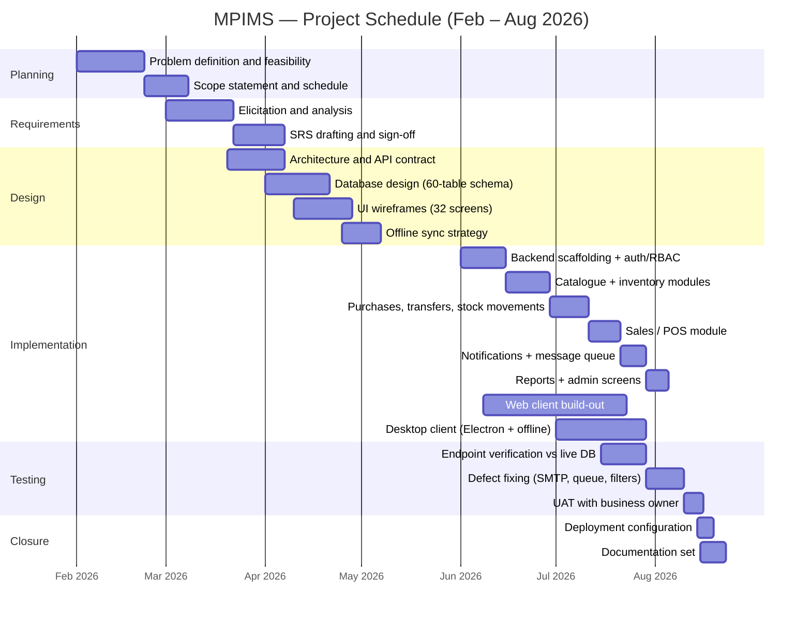

# 05 — Project Gantt Chart

**Project:** Multi-Platform Inventory Management System with RESTful API Backend
**Timeline:** February – August 2026 (7 months; implementation phase June –
August 2026 per repository history)

---

## 1. Gantt Chart

---

## 2. Schedule Table

| Phase | Task | Start | End | Duration |
|-------|------|-------|-----|----------|
| Planning | Problem definition & feasibility | Feb 01 | Feb 21 | 3 wks |
| Planning | Scope statement & schedule | Feb 22 | Mar 07 | 2 wks |
| Requirements | Elicitation & analysis | Mar 01 | Mar 21 | 3 wks |
| Requirements | SRS drafting & sign-off | Mar 22 | Apr 06 | 2 wks |
| Design | Architecture & API contract | Mar 20 | Apr 06 | ~2.5 wks |
| Design | Database design | Apr 01 | Apr 20 | ~3 wks |
| Design | UI wireframes (32 screens) | Apr 10 | Apr 27 | ~2.5 wks |
| Design | Offline sync strategy | Apr 25 | May 06 | ~1.5 wks |
| Implementation | Backend scaffolding, auth, RBAC | Jun 01 | Jun 14 | 2 wks |
| Implementation | Catalogue & inventory modules | Jun 15 | Jun 28 | 2 wks |
| Implementation | Purchases, transfers, movements | Jun 29 | Jul 10 | ~1.7 wks |
| Implementation | Sales / POS | Jul 11 | Jul 20 | ~1.4 wks |
| Implementation | Notifications & message queue | Jul 21 | Jul 28 | 1 wk |
| Implementation | Reports & admin screens | Jul 29 | Aug 04 | 1 wk |
| Implementation | Web client build-out | Jun 08 | Jul 22 | ~6.5 wks |
| Implementation | Desktop client (offline) | Jul 01 | Jul 28 | 4 wks |
| Testing | Endpoint verification vs live DB | Jul 15 | Jul 28 | 2 wks |
| Testing | Defect fixing | Jul 29 | Aug 09 | ~1.7 wks |
| Testing | User acceptance testing | Aug 10 | Aug 15 | ~1 wk |
| Closure | Deployment configuration | Aug 14 | Aug 18 | ~0.7 wk |
| Closure | Documentation set | Aug 15 | Aug 22 | ~1 wk |

*Backend, web-client and desktop tracks deliberately overlap; verification ran
continuously against the live database rather than as a single late phase.*

---

## 3. Milestones

| ID | Milestone | Date | Exit criterion |
|----|-----------|------|----------------|
| M1 | SRS approved | Apr 06 | Signed requirements baseline |
| M2 | Data model frozen | Apr 20 | Schema applied to development DB |
| M3 | Auth + inventory live on API | Jun 28 | Branch-scoped endpoints verified |
| M4 | Trading modules complete | Jul 20 | POS sale round-trip works |
| M5 | Messaging reliable | Jul 28 | Queue retries verified; e-mail delivered |
| M6 | Offline desktop proven | Jul 28 | Airplane-mode sale syncs cleanly |
| M7 | QA closed | Aug 09 | Lint/type-check clean; defect list empty |
| M8 | Handover pack issued | Aug 22 | docs/ complete (WBS, SRS, chapter, prototype, gantt, manual) |

---

## 4. Critical Path

Requirements → database design → backend auth/inventory → sales module →
desktop offline layer → defect fixing → documentation.
Slack exists in wireframing and reporting; none after M6 — closure activities
were fixed to the August submission date.

---

> **Note:** Mermaid renders this chart natively on GitHub/GitLab; for Word or
> PowerPoint, screenshot the rendered diagram or recreate from the schedule table.
